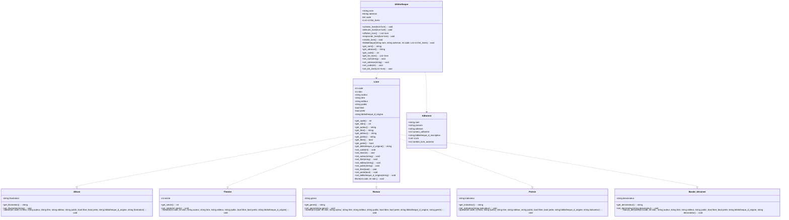

```mermaid
classDiagram
    blibliotheque ..> Livre
    blibliotheque ..> Adherent

    Livre ..|> Album
    Livre ..|> Theatre
    Livre ..|> Roman
    Livre ..|> Poesie
    Livre ..|> Bande_dessinee

    class blibliotheque{
    +string nom
    #string adresse
    #int code
    +List~int list_livres

    +acheter_livre(livre livre): void
    +detruire_livre(livre livre):void
    +afficher_livre(): List~livre
    +emprunter_livre(livre livre):void
    +rendre_livre():void

    +bibliotheque(string nom, string adresse, int code, List~int list_livres):void

    +get_nom(): string
    +get_adresse(): string
    +get_code(): int
    +get_list_livre(): List~livre

    +set_nom(string): void
    +set_adresse(string): void
    +set_code(int): void
    +set_list_livre(List~livre): void
    }

    class Adherent{
      +string nom
      +string prenom
      +string adresse
      +int numero_adherent
      +string bibliotheque_d_inscription
      +List~Livre 
      +int nombre_livre_autorise
    }

    class Livre{
      -int code
      -int isbn
      -string auteur
      -string titre
      -string editeur
      -string public
      -bool libre
      -bool prete
      -string bibliotheque_d_origine

      +get_code(): int
      +get_isbn(): int
      +get_auteur(): string
      +get_titre(): string
      +get_editeur(): string
      +get_public(): string
      +get_libre(): bool
      +get_prete(): bool
      +get_bibliotheque_d_origine(): string

      +set_code(int): void
      +set_isbn(int): void
      +set_auteur(string): void
      +set_titre(string): void
      +set_editeur(string): void
      +set_public(string): void
      +set_libre(bool): void
      +set_prete(bool): void
      +set_bibliotheque_d_origine(string): void

      #livre(int code, int isbn, ):void
    }

    class Album{
    -string illustration
    +get_illustration(): string
    +set_illustration(string): void

    +album(int code, int isbn, string auteur, string titre, string editeur, string public, bool libre, bool prete, string bibliotheque_d_origine, string illustration): void
    }

    class Theatre{
    -int siecle
    +get_siecle(): int
    +set_siecle(int siecle): void

    +theatre(int code, int isbn, string auteur, string titre, string editeur, string public, bool libre, bool prete, string bibliotheque_d_origine): void
    }

    class Roman{
    -string genre
    +get_genre(): string
    +set_genre(string genre): void

    +roman(int code, int isbn, string auteur, string titre, string editeur, string public, bool libre, bool prete, string bibliotheque_d_origine, string genre): void
    }

    class Poesie{
    -string indicateur
    +get_indicateur(): string
    +set_indicateur(string indicateur): void

    +poesie(int code, int isbn, string auteur, string titre, string editeur, string public, bool libre, bool prete, string bibliotheque_d_origine, string indicateur): void
    }

    class Bande_dessinee{
    -string dessinateur
    +get_dessinateur(): string
    +set_dessinateur(string dessinateur): void

    +bance_dessinee(int code, int isbn,  string auteur, string titre, string editeur, string public, bool libre, bool prete, string bibliotheque_d_origine, string dessinateur): void
    }
    
```