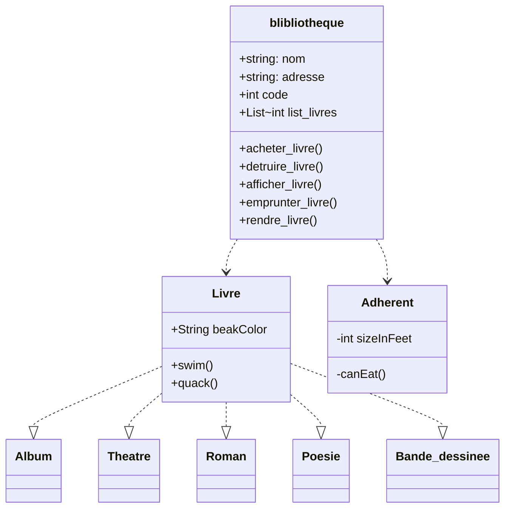

```mermaid
classDiagram
    blibliotheque ..> Livre
    blibliotheque ..> Adherent

    Livre ..|> Album
    Livre ..|> Theatre
    Livre ..|> Roman
    Livre ..|> Poesie
    Livre ..|> Bande_dessinee

    class blibliotheque{
    +string: nom
    +string: adresse
    +int code
    +List~int list_livres

    +acheter_livre()
    +detruire_livre()
    +afficher_livre()
    +emprunter_livre()
    +rendre_livre()
    
    }

    class Livre{
      +String beakColor 
      +swim()
      +quack()
    }
    class Adherent{
      -int sizeInFeet
      -canEat()
    }


```