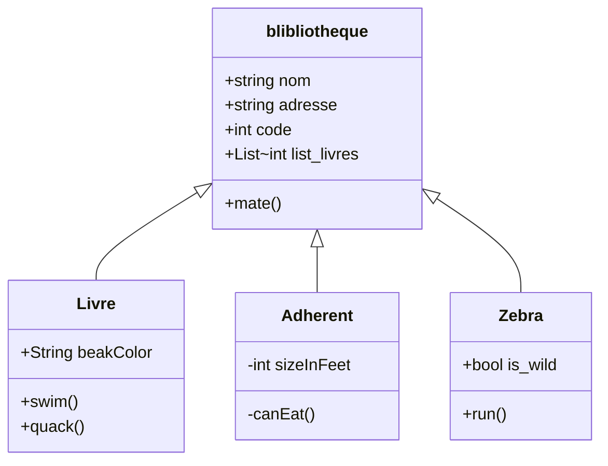

```mermaid
classDiagram
    blibliotheque <|-- Livre
    blibliotheque <|-- Adherent
    blibliotheque <|-- Zebra
    blibliotheque : +string nom
    blibliotheque : +string adresse
    blibliotheque : +int code
    blibliotheque : +List~int list_livres

    blibliotheque: +mate()
    class Livre{
      +String beakColor
      +swim()
      +quack()
    }
    class Adherent{
      -int sizeInFeet
      -canEat()
    }
    class Zebra{
      +bool is_wild
      +run()
    }

```