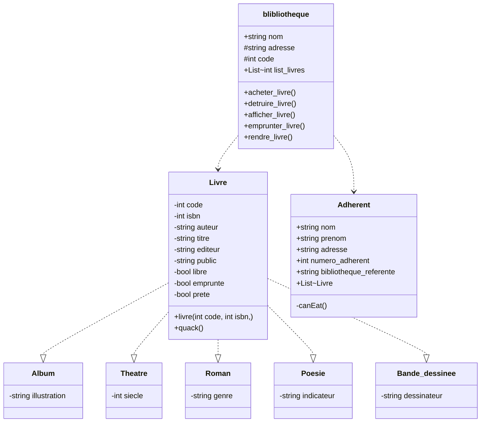

```mermaid
classDiagram
    blibliotheque ..> Livre
    blibliotheque ..> Adherent

    Livre ..|> Album
    Livre ..|> Theatre
    Livre ..|> Roman
    Livre ..|> Poesie
    Livre ..|> Bande_dessinee

    class blibliotheque{
    +string nom
    #string adresse
    #int code
    +List~int list_livres

    +acheter_livre()
    +detruire_livre()
    +afficher_livre()
    +emprunter_livre()
    +rendre_livre()
    
    }

    class Adherent{
      +string nom
      +string prenom
      +string adresse
      +int numero_adherent
      +string bibliotheque_referente
      +List~Livre 
      -canEat()
    }

    class Livre{
      -int code
      -int isbn
      -string auteur
      -string titre
      -string editeur
      -string public

      -bool libre
      -bool emprunte
      -bool prete

      +livre(int code, int isbn, )
      +quack()
    }

    class Album{
    -string illustration
    }

    class Theatre{
    -int siecle
    }

    class Roman{
    -string genre
    }

    class Poesie{
    -string indicateur
    }

    class Bande_dessinee{
    -string dessinateur
    }


```